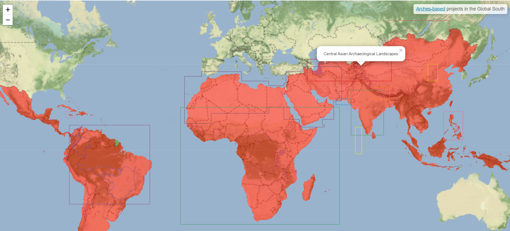

# cultural-heritage
> common repository

## Graph
> [graph-parser](https://github.com/achp-project/cultural-heritage/tree/main/graph-parser): to model the semantic structure of the graph of resource data from different Arches-based projects

Visualize an Arches-based graph in a form of an interactive collapsible tree: **[EAMENA Heritage Place](https://achp-project.github.io/cultural-heritage/graph-parser/docs/sampleOutput/EAMENA_Heritage%20Place.html)** [^3]
## Map
> [map-projects](https://github.com/achp-project/cultural-heritage/tree/main/map-projects): to map the region of interest of different Arches-based projects

Global South Arches-based projects are (roughly) mapped here: https://achp-project.github.io/cultural-heritage/map-projects/arches-global-south.html [^1]

## Thesauri
> [sparql-projects](https://github.com/achp-project/cultural-heritage/tree/main/sparql-projects): to model the semantic structure of the graph of resource data from different Arches-based projects

Vizualise an Arches-based thesaurus in a form of an interactive collapsible tree: **https://achp-project.github.io/cultural-heritage/sparql-projects/EAMENA.html** [^2]

## PeriodO
> [periodo-projects](https://github.com/achp-project/cultural-heritage/tree/main/periodo-projects): to map Arches cultural periods to the PeriodO gazetteer

[^1]: [prj_map.R](https://github.com/achp-project/cultural-heritage/blob/main/map-projects/prj_map.R)
[^2]: [thesaurus.R](https://github.com/achp-project/cultural-heritage/blob/main/sparql-projects/thesaurus.R)
[^3]: [graph_parser.py](https://github.com/achp-project/cultural-heritage/blob/main/graph-parser/graph_parser.py)
