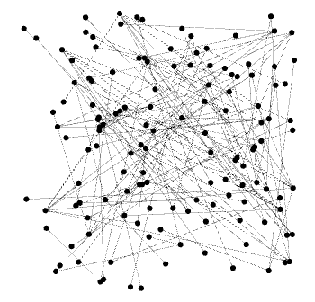
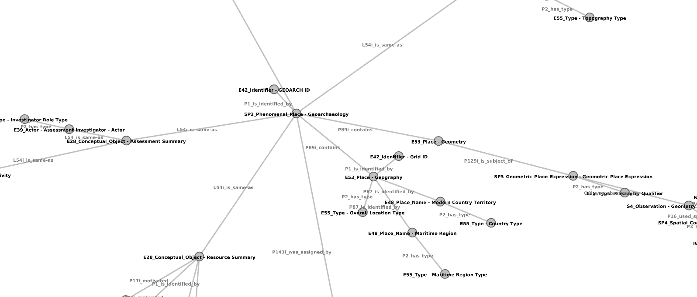
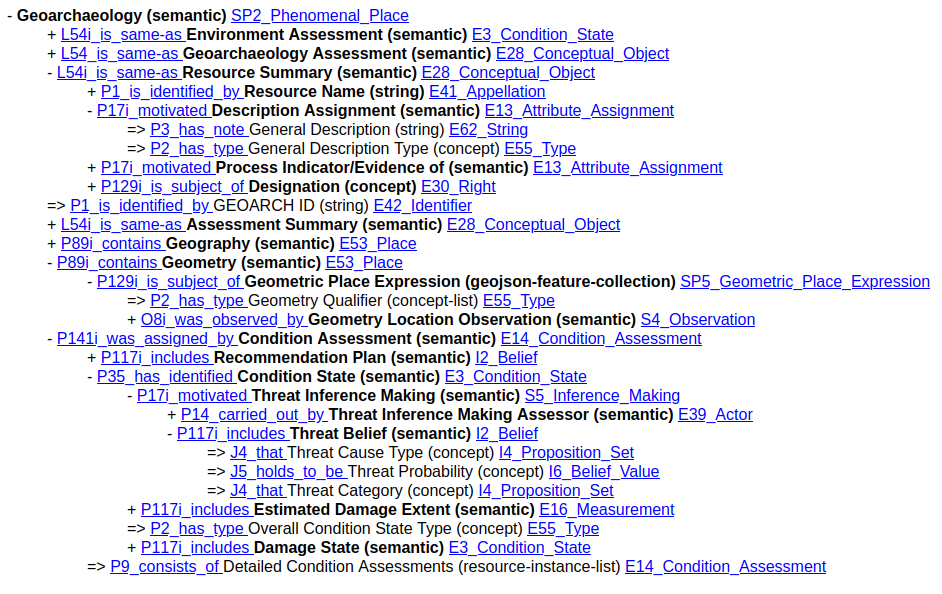
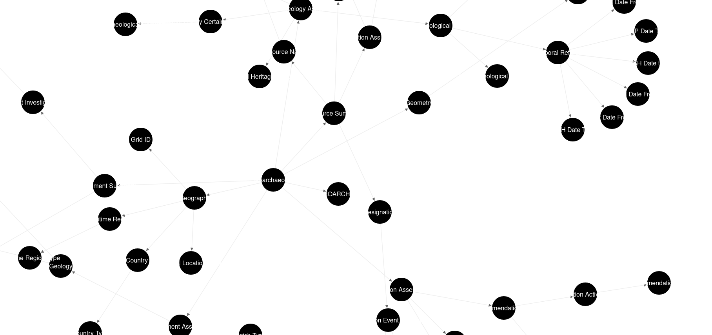

# Arches Graph Parser

[Graph Parser](https://github.com/achp-project/cultural-heritage/blob/main/graph-parser/README.md#graph-parser) and [Graph Comparator](https://github.com/achp-project/cultural-heritage/blob/main/graph-parser/README.md#graph-comparator) allow to parse and compare Arches resource models (RM). Outputs are interactive HTML graph visualizations and Gephi files. 
Supports single local file loading (with wildcard support) as well as remote URL loading.

## Version

Tested under the following versions:
* Python 3.8
* Arches 7.3 Exported Graph JSON files


## Installing env & dependencies

To build env from **settings.txt**:

```bash
# Supports paths for env
python -m venv newEnv
# Go into the graph parser directory
cd cultural-heritage/graph-parser
source newEnv/bin/activate
pip install -r requirements.txt
```

## Graph Parser

The parser can be run for a single file in the local filesystem.
For instance, to load the sample MAPHSA toy model:

```bash
python graph_parser.py "sourceGraphData/MAPHSA/MAPHSA Heritage Item.json"
```

This command will generate the output HTML and Gephi files, as well as the HTML dependencies, in the current directory.
To control the output placement, the parameter -o can be used:

```bash
python graph_parser.py "sourceGraphData/MAPHSA/MAPHSA Heritage Item.json" -o output/MAPHSA
```

This allows to place all the output in the provided directory.

### Batch Processing

Alternatively, the wildcard operator can be used to generate for all JSON in the same folder.
If several graph files were present in the same location, this command would process them simultaneously:

```bash
python graph_parser.py sourceGraphData/EAMENA/*.json -o output/EAMENA
```

### Remote Graph Load

The parser also supports loading through a textual URL as shown in the next example:

```bash
python graph_parser.py https://github.com/achp-project/prj-mapss/blob/main/pkg/graphs/Geoarchaeology.json -o output/MAPPS
```

Note that this mode does not support multiple URLs to be batch processed at the moment.

### Command Line Interface Help

This would work if the [JSON data for the EAMENA graphs](https://github.com/achp-project/prj-eamena-marea/tree/main/resource_models) is placed in the provided folder.

The help message for the CLI interface can also be read by running with the -h parameter.

```bash
python graph_parser.py -h

usage: graph_parser.py [-h] [-w [W]] [-o [O]] [input_files [input_files ...]]

positional arguments:
  input_files  local input graph files

optional arguments:
  -h, --help   show this help message and exit
  -w [W]       remote input graph files
  -o [O]       output folder

```

## Output Graphs

The parser currently generates three distinct outputs:

* An unordered [Gephi](https://gephi.org/) .gexf file
* An interactive collapsible list tree with links
* A dynamic force collapsible tree (not very readable yet)

### Gephi File

The current output .gexf file is unordered and hardly useful until ordered.


To make it slightly more manageable, some recommended steps include:
1. [Apply a Layout (for instance Yifan Hu)](https://subscription.packtpub.com/book/big-data-/9781783987405/3/ch03lvl1sec43/using-the-yifan-hu-multilevel-layout-algorithm)
2. [Enable node and edge labels](https://gephi.org/tutorials/gephi-tutorial-quick_start.pdf)

This should make the visualization informative and usable to a certain extent:

Remember that zooming, scrolling and dragging nodes can help in making sense of the network.

### Collapsible list Tree

The list contains a simple hierarchical view of the model with the links to the CIDOC classes for each node.
**To open and collapse node right click is necessary**



### Dynamic Force Tree

Shows all nodes and allows to collapse them with a simple click.
This visualization is currently work in progress, its lack of styling and interactions renders it mostly useless.



## Examples

Here are some exaples in case you want to skip ahead and see results generated with the parser:
* [EAMENA's Heritage Place circa 06/06/23](docs/sampleOutput/EAMENA_Heritage%20Place.html)
* [MAPPS's Geoarchaeology circa 06/06/23](docs/sampleOutput/MAPPS_Geoarchaeology.html)


## Graph Comparator

The graph comparator allows to get metrics on CIDOC-CRM Common Minimal Subgraphs (CMS) between two resource models (RM). It uses the same ENV [requirements](requirements.txt) file that the graph parser from the previous sections.

```bash
# Supports paths for env
python -m venv newEnv
# Go into the graph parser directory
cd cultural-heritage/graph-parser
source newEnv/bin/activate
pip install -r requirements.txt
```
### Running the Comparator using the CLI

The most straightforward way to compare graphs would be to use the command line interface to generate the metrics
(perhaps to process later).

```bash
python graph_comparator.py ExportedResourceGraph1.json ExportedResourceGraph2.json
```

For instance, we could compare two of the graphs present in the repo (watch for space character encoding):

```bash
python graph_comparator.py sourceGraphData/EAMENA/Heritage\ Place.json sourceGraphData/EAMENA/Heritage\ Place.json sourceGraphData/MAPHSA/MAPHSA\ Heritage\ Item.json
```

or

```bash
py graph_comparator.py "sourceGraphData/EAMENA/Heritage Place.json" "sourceGraphData/EAMENA/Heritage Place.json"
```

Would print a long data structure containing all the comparison metrics and instances.
To better control the output, you could use the `-o` parameter:

```bash
python graph_comitage\ Place.json sourceGraphData/EAMENA/Heritage\ Place.json sourceGraphData/MAPHSA/MAPHSA\ Heritage\ Item.json -o output/comparisonResults.json
```

or 

```bash
py graph_comparator.py "sourceGraphData/EAMENA/Heritage Place.json" "sourceGraphData/EAMENA/Heritage Place.json" -o output/comparisonResults.json
```

Will give this file: [comparisonResults.json](../www/comparisonResults.json)

Or even pipe it to an output file if your OS supports it:

```bash
python graph_comparator.py sourceGraphData/EAMENA/Heritage\ Place.json sourceGraphData/EAMENA/Heritage\ Place.json sourceGraphData/MAPHSA/MAPHSA\ Heritage\ Item.json > output/comparisonResults.json
```

Keep in mind that the script allows multiple inputs beyond two graphs, so theoretically you could do something like:

```bash
python graph_comparator.py ExportedResourceGraph1.json ExportedResourceGraph2.json ExportedResourceGraph3.json ExportedResourceGraph4.json
```

Or if your OS supports wildcard operators:

```bash
python graph_comparator.py *.json > comparisonResults.json
```

### Graph Comparator Output

The output is a serialized JSON structure with a loose schema.

```json5
{
    // Dict containing individual CIDOC graph minimal subgraph metrics
    "minimal_subgraph_data": {
        ...
        },
    // Dict containing pair CIDOC graph common minimal subgraph metrics 
    "graph_comparison_data": {
        ...
        }
}
```

#### minimal_subgraph_data

This dictionary contains individual CIDOC graph minimal subgraph (ms) metrics. For instance, a potential entry of *minimal_subgraph_data*:

```json5
// Name of the Resource model graph referenced
"Heritage Place":
        {
            // Composed key, composed by the CIDOC parent node class, relation class, and child class
            "E27_Site$P53_has_former_or_current_location$E53_Place":
            { // List containing split CIDOC parent nodeclass, relation, and child CIDOC class 
                "cms":
                [
                    "E27_Site",
                    "P53_has_former_or_current_location",
                    "E53_Place"
                ], 
                    // Instances, containing the actual ids of the parent node, child node, and graph
                    //(all belong to the same graph)
                "instances":
                [
                    [
                        "34cfea3b-c2c0-11ea-9026-02e7594ce0a0", // E27_Site node id
                        "34cfe9b6-c2c0-11ea-9026-02e7594ce0a0", // E53_Place node id
                        "34cfe98e-c2c0-11ea-9026-02e7594ce0a0" // All belong to Heritage Place
                    ],
                    [
                        "34cfea3b-c2c0-11ea-9026-02e7594ce0a0", // E27_Site node id
                        "3080eebe-c2c5-11ea-9026-02e7594ce0a0", // E53_Place node id
                        "34cfe98e-c2c0-11ea-9026-02e7594ce0a0" // All belong to Heritage Place
                    ],
                    //...
                ]
            },
            //...
          }
```
Note that the node and graph ids can be retrieved from the original Arches resource model graph JSON files used for input.

#### graph_comparison_data

For the *graph_comparison_data* file, a similar structure exists:

```json5
       // Composed key made of the names of the two compared graphs
        "Heritage Place$MAPHSA Heritage Item":
        {   // Composed key, composed by the CIDOC parent node class, relation class, and child class
            "E53_Place$P2_has_type$E55_Type":
            {
            // Instances, containing the actual ids of the parent node, child node, and graph
            //(they belong to either of the two compared graphs)    
           "instances":
                [
                    [
                        "34cfe9dd-c2c0-11ea-9026-02e7594ce0a0", // E53_Place node id
                        "34cfea97-c2c0-11ea-9026-02e7594ce0a0", // E55_Type node id
                        "34cfe98e-c2c0-11ea-9026-02e7594ce0a0" // Belongs to Heritage Place
                    ],
                    [
                        "4158c3e6-efe1-11ed-a506-4bd9db6d2413", // E53_Place node id
                        "73f8e4ca-efe1-11ed-a506-4bd9db6d2413", // E55_Type node id
                        "f72fa003-859f-46ef-8bc2-41d0051c2c76" // Belongs to MAPHSA Heritage Item
                    ],
                    //...
                ]
            },
            //...

```

### Graph Comparator Usage Example

A [simple file](../test-projects/test_graph_comparator.py) has been included to showcase how to use the graph comparator.
It is a simple routine that compares two or more Arches resource models and prints the common minimal subgraphs.
The main body can be tuned to get the desired comparison.

```python
# Resource model graphs to be loaded, the program supports as many as desired, although the output gets tricky to read
resource_models = [
	graph_parser + "/sourceGraphData/MAPHSA/MAPHSA Heritage Item.json",
	graph_parser + "/sourceGraphData/EAMENA/Heritage Place.json",
]

# Gather input file URLs
input_files: list = [Path(r) for r in resource_models]

# Run the graph comparator
result_data = get_comparison_data(input_files)

# Print individual graph metrics for ms
# print_individual_minimal_subgraph_metrics(result_data)

# Print the comparison of common minimal subgraphs
print_comparison_common_minimal_subgraph_metrics(result_data)
```

The *resource_model* list can be extended to add more Arches resource models to the comparison.
Also, the commented *print_individual_minimal_subgraph_metrics()* method prints an exhaustive list of the minimal subgraph instances for the included input.
This can easily flood the output console, so it is disabled by default.

Running this just requires a virtualenv with the [included requirements](requirements.txt):

```bash
python test_graph_comparator.py 
```
The output shows the overlap between the usage of CIDOC classes and relations, the common minimal subgraphs:

```
[5] common instance(s) of Minimal Subgraph for E52_Time-Span => P82a_begin_of_the_begin => E61_Time_Primitive

    [MAPHSA Heritage Item]	(E52_Time-Span) Cultural Affiliation Duration => P82a_begin_of_the_begin => (E61_Time_Primitive) Cultural Affiliation from Date
    [Heritage Place]	(E52_Time-Span) Designation Event Timespan => P82a_begin_of_the_begin => (E61_Time_Primitive) Designation From Date
    [Heritage Place]	(E52_Time-Span) Disturbance Event Timespan => P82a_begin_of_the_begin => (E61_Time_Primitive) Disturbance Date From
    [Heritage Place]	(E52_Time-Span) Archaeological Timespace => P82a_begin_of_the_begin => (E61_Time_Primitive) Archaeological From Date
    [Heritage Place]	(E52_Time-Span) Disturbance Event Timespan => P82a_begin_of_the_begin => (E61_Time_Primitive) Disturbance Date From

[2] common instance(s) of Minimal Subgraph for E13_Attribute_Assignment => P2_has_type => E55_Type

    [MAPHSA Heritage Item]	(E13_Attribute_Assignment) Related Features Summary => P2_has_type => (E55_Type) Feature Type
    [Heritage Place]	(E13_Attribute_Assignment) Description Assignment => P2_has_type => (E55_Type) General Description Type

[2] common instance(s) of Minimal Subgraph for E41_Appellation => P2_has_type => E55_Type

    [MAPHSA Heritage Item]	(E41_Appellation) Site Name => P2_has_type => (E55_Type) Name Type
    [Heritage Place]	(E41_Appellation) Resource Name => P2_has_type => (E55_Type) Name Type

[4] common instance(s) of Minimal Subgraph for E53_Place => P2_has_type => E55_Type

    [MAPHSA Heritage Item]	(E53_Place) Administrative Subdivision => P2_has_type => (E55_Type) Type
    [Heritage Place]	(E53_Place) Geography => P2_has_type => (E55_Type) Overall Site Shape Type
    [Heritage Place]	(E53_Place) Geography => P2_has_type => (E55_Type) Resource Orientation
    [Heritage Place]	(E53_Place) Administrative Division  => P2_has_type => (E55_Type) Administrative Division Type

```