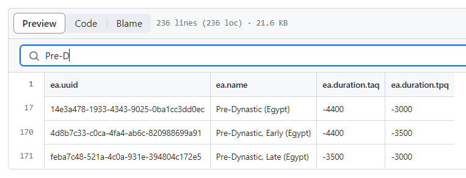
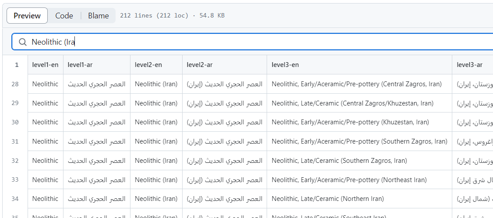
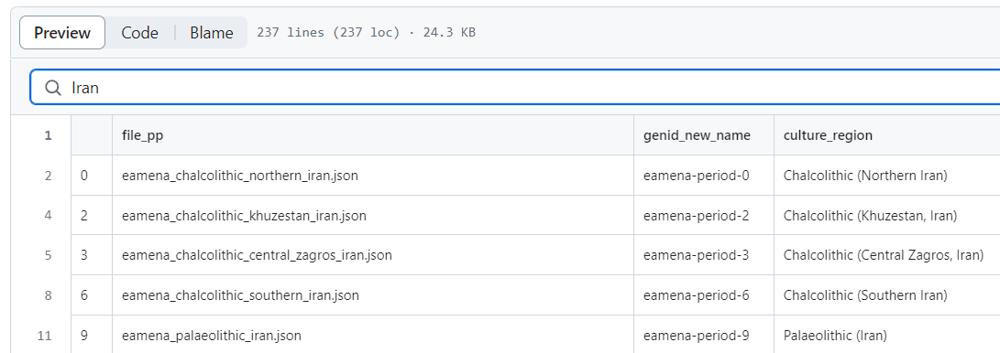
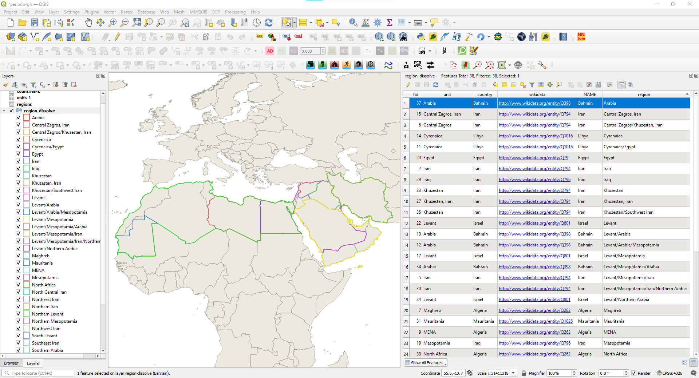
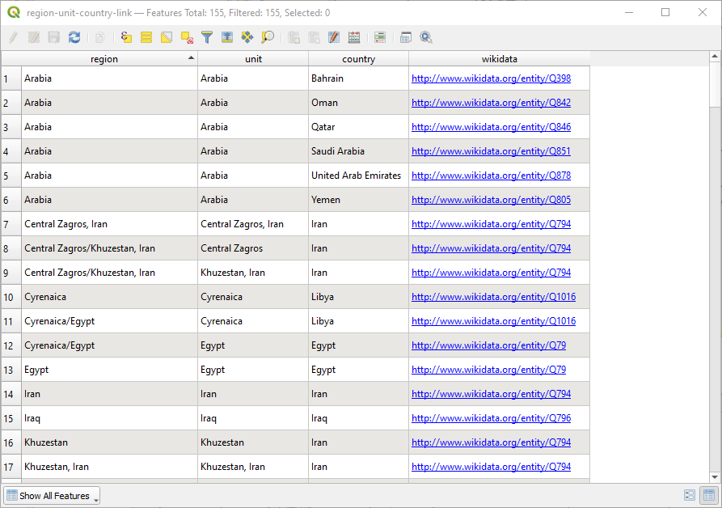

# EAMENA/Arches periods to PeriodO

Our goal is to export Arches cultural periods, and subperiods, as new entries in [PeriodO](#periodo) in an [automated way](#automated-creation-of-periodo-files). 

## PeriodO

  
   
    <em>screenshot of the `Predynastic` record in PeriodO</em>

[PeriodO](https://perio.do/en/) is a temporal gazetteer. In PeriodO, each period is composed of:
- a duration (`start` and `stop`)
- a geographical extension (`spatialCoverage`)
- an authority (`authorities`)

An example of the `Predynastic` JSON is [here](https://github.com/eamena-project/eamena-arches-dev/blob/main/projects/periodo/periodo-period-cp44786m7.json) [^1].

## EAMENA Data

EAMENA has [this list](https://github.com/achp-project/cultural-heritage/blob/main/periodo-projects/cultural_periods.tsv) of periods and subperiods: 

  
   
    <em>EAMENA periods (filtered on 'Pre-Dynastic')</em>

These these periods and subperiods have [these hierachical reltionships](https://github.com/achp-project/cultural-heritage/blob/main/periodo-projects/rdm-bu-period-levels.tsv):

  
   
    <em>EAMENA periods hierachical relationships (level1, level2, etc.)</em>

Alignement between EAMENA and wikidata regions can be done using [this mapping table](https://github.com/achp-project/cultural-heritage/blob/main/periodo-projects/wikidata_period.tsv)

  
   
    <em>List of wikidata links for each period region</em>

## Workflow

The script [create_periodo_json.py](https://github.com/achp-project/cultural-heritage/blob/main/periodo-projects/create_periodo_json.py) automated the creation of JSON file by:

1. reading this [PeriodO template](https://gist.github.com/rybesh/9f64c127ad8eeb69619896f22064bb0e#file-example-dataset-json)
2. replacing the values with: EAMENA `ea.duration.taq` and `ea.duration.tpq` (PeriodO `start` and `stop`), etc.
3. collecting wikidata URI for spatial coverages 
4. use the file [rdm-bu-period.check.xlsx](https://github.com/achp-project/cultural-heritage/blob/main/periodo-projects/rdm-bu-period-check.xlsx)[^4] to gather: Arabic translation, broader periods (ie, parent period)

## Results

Results are in the [export/ folder](https://github.com/achp-project/cultural-heritage/tree/main/periodo-projects/exports)

The file [df_broader](https://github.com/achp-project/cultural-heritage/blob/main/periodo-projects/df_broader.tsv) list the correspondances between the files name (`file_pp`), their PeriodO id (`genid_new_name`) and the period recorded in this file (`culture_region`)

  
   
    <em>Mapping table between periods, files and PeriodO ids</em>

## Wikidata

Wikidata spatial coverages:

  
  
   
    <em>Correspondances between EAMENA periods' spatial coverage and wikidata URI</em>

The list of wikidata links for each period region and a [polygon file for mapping the wkt regions](https://github.com/achp-project/cultural-heritage/blob/main/periodo-projects/period_regions.tsv) are in tsv format.

---

[^1]: This example corresponding to the URL: https://client.perio.do/?page=period-view&backendID=web-https%3A%2F%2Fdata.perio.do%2F&authorityID=p0cp447&periodID=p0cp44786m7
[^2]: in parentesis in the [cultural_periods.tsv](https://github.com/achp-project/cultural-heritage/blob/main/periodo-projects/cultural_periods.tsv)'s `ea.name` field. For example 'Egypt'
[^3]: For example, PeriodO `"earliestYear": "0901"` gives `"label": "late seventh century"`
[^4]: This XLSX file is exported to a TSV using the Python script [convert_xlsx_to_tsv.py](./convert_xlsx_to_tsv.py)