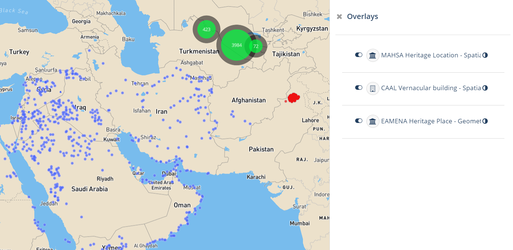

# Arches Cultural Heritage Partners' hackathon 2024
> 📅 9am-6pm, 27-28 August, 2024 [📍Seminar Room, Institute of Archaeology, 36 Beaumont St](https://maps.app.goo.gl/MtAMkX57pxdbF6Ue9), University of Oxford, United Kingdom.

Two days of collaborative Python coding to enhance interoperability and reusability within our Arches-based project.

## impact
> 📅 28 August 2024, 17h00-18h00 (UK time). In person [📍Seminar Room, Institute of Archaeology, 36 Beaumont St](https://maps.app.goo.gl/MtAMkX57pxdbF6Ue9) and on [Teams](https://teams.microsoft.com/l/meetup-join/19%3ameeting\_ZTYyNTJmMDEtMWJmMC00NDk2LWJkMGQtMzgwZWI5Y2FlODgy%40thread.v2/0?context=%7b%22Tid%22%3a%22cc95de1b-97f5-4f93-b4ba-fe68b852cf91%22%2c%22Oid%22%3a%229dce33a8-66a7-403f-a2c6-95948cb855d0%22%7d), University of Oxford, United Kingdom.

The workshop will open with a one-hour talk open to the public on the management of cultural heritage and archeology databases. In-person + Online (hybrid).

see the [Jupyter NB of the talk](https://colab.research.google.com/github/achp-project/cultural-heritage/blob/main/talks/2024-hackathon/achp_hackathon.ipynb)

## participants and projects

* @razekmh, [CAAL](https://github.com/achp-project/prj-caal), [MAEASaM](https://github.com/achp-project/prj-maeasam)
* @junaidjabbar01, [MASHA](https://github.com/achp-project/prj-mahsa)
* @ads04r, [MaREA](https://github.com/achp-project/prj-eamena-marea)
* @zoometh, [EAMENA](https://github.com/achp-project/prj-eamena-marea)

## work done 

* Docker deployement of Arches v7.5
* imported reference data from EAMENA, CAAL, MAHSA, MAEASaM
* imported business data EAMENA, CAAL, MAHSA, MAEASaM
* creation of an [Arches App](https://arches.readthedocs.io/en/stable/developing/extending/creating-apps/): [dashboard](https://github.com/achp-project/dashboard)

