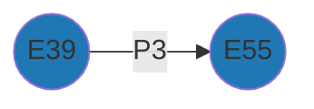

# Comparing Resource Models

Given Arches Resource Models (RM) CIDOC-CRM compliants coming from different projects, the aim is to identify which edges are commons subgraphs (ie, same minimal common semantisation)

## Pairwise comparison

  
  
   
    <em>Comparison between G1 and G2</em>

The only common subgraph between G1 and G2 is

Indeed:
* the second edges (`E55` -- `E2`) have different proprieties (`P4` and `P1`);
* the third edges (`E2` -- `E7`) have the same proprieties (`P5`) but different directions (`E2` --> `E7`; `E2` <-- `E7`)

The dataframe view of G1 is:

|    | source   | target   | property   |
|---:|:---------|:---------|:-----------|
|  0 | E39      | E55      | P3         |
|  1 | E55      | E2       | P4         |
|  2 | E2       | E7       | P5         |

The dataframe view of G2 is:

|    | source   | target   | property   |
|---:|:---------|:---------|:-----------|
|  0 | E39      | E55      | P3         |
|  1 | E55      | E2       | P4         |
|  2 | E2       | E7       | P5         |

The common row (ie common subgraph) between G1 and G2 is:

|    | source   | target   | property   |
|---:|:---------|:---------|:-----------|
|  0 | E39      | E55      | P3         |

