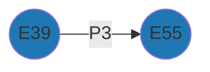

# Comparing Resource Models

Given Arches Resource Models (RM) CIDOC-CRM compliants coming from different projects, the aim is to identify which are the commons subgraphs (ie, same minimal common semantisation).

corresponding code chunks are provided (click on 🐍)

## Pairwise comparison

Given these two directed graphs (see [🐍](https://github.com/achp-project/cultural-heritage/blob/7329f1e970a9e5ab3f217961e47bb743fe56d2dc/test-projects/ged_example_2.py#L7C1-L45))

  
  
   
    <em>Comparison between G1 and G2</em>

There's only one common subgraph between G1 and G2[^1]:

The dataframe views of G1 and G2 are respectively:

|    | source   | target   | property   |
|---:|:---------|:---------|:-----------|
|  0 | E39      | E55      | P3         |
|  1 | E55      | E2       | P4         |
|  2 | E2       | E7       | P5         |

and:

|    | source   | target   | property   |
|---:|:---------|:---------|:-----------|
|  0 | E39      | E55      | P3         |
|  1 | E55      | E2       | P4         |
|  2 | E2       | E7       | P5         |

(see [🐍](https://github.com/achp-project/cultural-heritage/blob/7329f1e970a9e5ab3f217961e47bb743fe56d2dc/test-projects/ged_example_2.py#L47-L78
))

The common row (ie common subgraph) between G1 and G2 is:

|    | source   | target   | property   |
|---:|:---------|:---------|:-----------|
|  0 | E39      | E55      | P3         |

(see [🐍](https://github.com/achp-project/cultural-heritage/blob/7329f1e970a9e5ab3f217961e47bb743fe56d2dc/test-projects/ged_example_2.py#L81-L87
))

[^1]: Indeed, the second edges (`E55` -- `E2`) have different proprieties (`P4` and `P1`); the third edges (`E2` -- `E7`) have the same proprieties (`P5`) but different directions (`E2` --> `E7`; `E2` <-- `E7`)