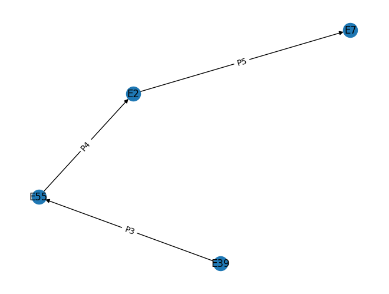
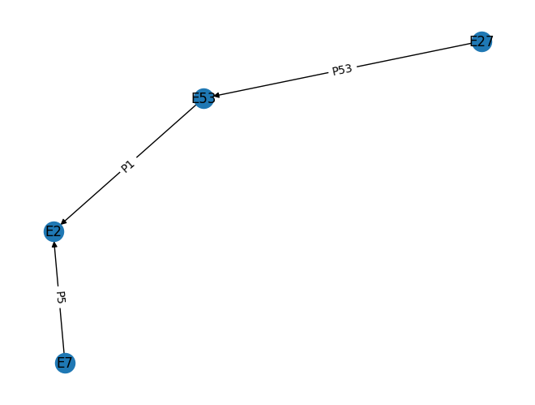
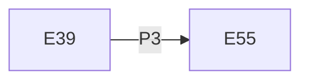

# Comparing Resource Models

Given two Arches Resource Models (RM) CIDOC-CRM compliants, the aim is to identify which edges are commons subgraphs

  
  
   
    <em>Comparison between `G1` and `G2`</em>

The only common subgraph between G1 and G2 is

Indeed:
* the second edges (`E55` -- `E2`) have different proprieties (`P1` and `P4`);
* the third edges (`E2` -- `E7`) have the same proprieties (`P5`) but different directions (`E2` --> `E7`; `E2` <-- `E7`)