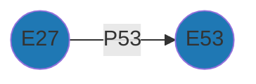
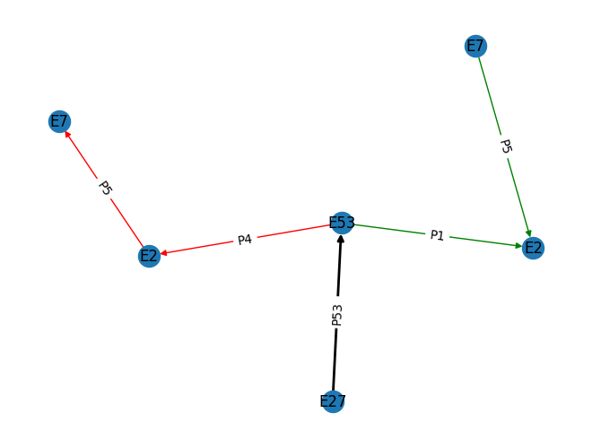

# Comparing Resource Models

Given Arches Resource Models (RM) CIDOC-CRM compliants coming from different projects, the aim is to identify which are the minimal common subgraphs (MCS). 

## Minimal Subgraph

Minimal Subgraphs (MS) are single triples '*subject-predicate-object*' For example:

  
   
  <em>Semantisation of the Heritage place (E27_Site) and its geometry (E53_Place) through the property 'location' (P53_has_former_or_current_location) in the Heritage place Ressource Model (database: EAMENA)</em>

Where:

* E27_Site: is the *subject*
* E53_Place: is the *predicate*
* P53_has_former_or_current_location: is the *object*

This is the graph representation of this semantisation:

This is the dataframe representation of this semantisation:

|    | source   | target   | property   |
|---:|:---------|:---------|:-----------|
|  0 | E27      | E53      | P53        |

## Common Minimal Subgraph

Minimal common subgraph (MCS) are MS identical in two different graphs. 
### Pairwise comparison

Given these two directed graphs

  
  
   
    <em>Comparison between G1 and G2, where 'E' are CIDOC-CRM entities and 'P' are CIDOC-CRM properties</em>

There's only one MCS between G1 and G2[^1]:

The dataframe views of G1 and G2 are respectively:

|    | source   | target   | property   |
|---:|:---------|:---------|:-----------|
|  0 | E27      | E53      | P53        |
|  1 | E53      | E2       | P4         |
|  2 | E2       | E7       | P5         |

and:

|    | source   | target   | property   |
|---:|:---------|:---------|:-----------|
|  0 | E27      | E53      | P53        |
|  1 | E53      | E2       | P1         |
|  2 | E7       | E2       | P5         |

The common row (ie MCS) between G1 and G2 is:

|    | source   | target   | property   |
|---:|:---------|:---------|:-----------|
|  0 | E27      | E53      | P53        |

### Plot

  
   
    <em>G1 (red) and G2 (green) merged graphs on their MCS (in black)</em>

[^1]: Indeed, the second edges (`E55` -- `E2`) have different proprieties (`P4` and `P1`); the third edges (`E2` -- `E7`) have the same proprieties (`P5`) but different directions (`E2` --> `E7`; `E2` <-- `E7`)